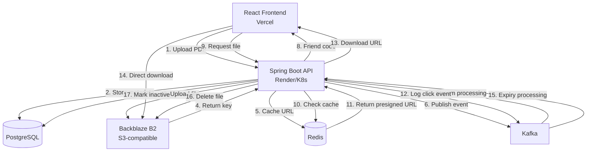
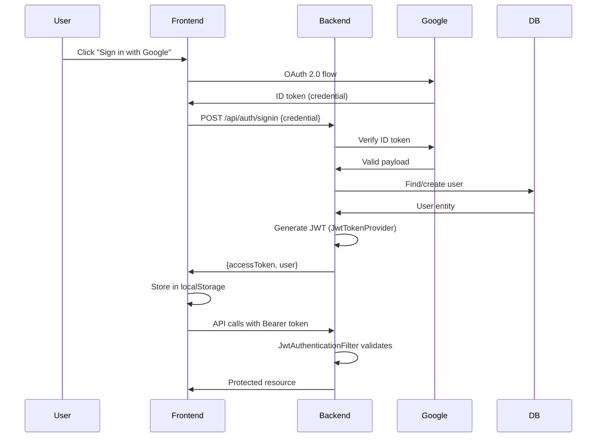

## System Architecture

Closeness Decoder is a secure file sharing platform built with a modern microservices-oriented architecture. The system handles temporary file sharing with automatic expiry, leveraging event-driven patterns for scalability and reliability.

<CardGroup cols={2}>
  <Card title="Backend" icon="server" href="/architecture/backend">
    Spring Boot 4.0.1 REST API with PostgreSQL, Redis, and Kafka
  </Card>
  <Card title="Frontend" icon="browser" href="/architecture/frontend">
    React 19.2.0 with TypeScript, Vite, and React Router
  </Card>
  <Card title="Storage" icon="database" href="/architecture/storage">
    S3-compatible Backblaze B2 with presigned URLs
  </Card>
  <Card title="Deployment" icon="rocket" href="/deployment/backend-setup">
    Kubernetes (backend) and Vercel (frontend)
  </Card>
</CardGroup>

## Component Interaction

The following diagram illustrates how the main components interact:

## Data Flow

### File Upload Flow

1. **User Authentication**: Frontend sends Google OAuth credential to `/api/auth/signin`
2. **JWT Issuance**: Backend validates via `AuthServiceImpl` (org/closeness/decoder/service/impl/AuthServiceImpl.java:75) and returns JWT token
3. **File Upload**: Authenticated user uploads PDF via `/api/friend-url/upload`
4. **Storage**: `S3ServiceImpl` uploads to Backblaze B2 using AWS SDK (org/closeness/decoder/service/impl/S3ServiceImpl.java:169)
5. **Metadata**: Creates `FriendUrl` entity with 60-minute expiry (org/closeness/decoder/service/impl/S3ServiceImpl.java:108)
6. **Caching**: Stores presigned URL in Redis via `RedisCacheService`
7. **Event Publishing**: Publishes upload event to Kafka topic `friend-file-upload-events` (org/closeness/decoder/service/KafkaProducer.java:20)
8. **Response**: Returns unique friend code (UUID) to frontend

### File Access Flow

1. **Friend URL Request**: User navigates to `/friend-url/{friendCode}` (public route)
2. **Cache Lookup**: Backend checks Redis for presigned URL (org/closeness/decoder/service/impl/S3ServiceImpl.java:139)
3. **Database Fallback**: If cache miss, queries PostgreSQL `FriendUrl` table
4. **Click Event**: Publishes click event to Kafka topic `friend-link-click-events` (org/closeness/decoder/service/KafkaProducer.java:42)
5. **URL Return**: Returns presigned URL (45-minute validity)
6. **Direct Download**: Frontend downloads directly from Backblaze B2

### Expiry & Cleanup Flow

1. **Stream Processing**: Kafka Streams topology monitors upload events (org/closeness/decoder/service/KafkaStreamsTopology.java:58)
2. **State Store**: Maintains expiry schedule in persistent key-value store `expiry-store`
3. **Expiry Detection**: `UploadEventProcessor` detects expired files
4. **Cleanup Execution**: `S3CleanupService` deletes from B2 and marks inactive in database (org/closeness/decoder/service/S3CleanupService.java:19)
5. **Click Aggregation**: `ClickEventProcessor` aggregates clicks in `click-store` and flushes to database

## Technology Stack

### Backend

- **Framework**: Spring Boot 4.0.1 (Java 17)
- **Database**: PostgreSQL with Spring Data JPA
- **Cache**: Redis with Spring Cache abstraction
- **Message Queue**: Apache Kafka with Kafka Streams
- **Storage SDK**: AWS SDK for Java 2.41.13 (S3-compatible)
- **Authentication**: Google OAuth 2.0 + JWT (jjwt 0.12.3)
- **Security**: Spring Security with stateless sessions

<Info>
See the complete dependency list in `backend/pom.xml`
</Info>

### Frontend

- **Framework**: React 19.2.0 with TypeScript 5.9.3
- **Build Tool**: Vite 7.2.4
- **Routing**: React Router DOM 7.12.0
- **HTTP Client**: Axios 1.13.2 with interceptors
- **OAuth**: @react-oauth/google 0.13.4

<Info>
See the complete dependency list in `frontend/package.json`
</Info>

### Infrastructure

- **Backend Hosting**: Render (Kubernetes)
- **Frontend Hosting**: Vercel
- **Object Storage**: Backblaze B2 (S3-compatible)
- **Database**: Managed PostgreSQL
- **Cache**: Managed Redis (SSL/TLS)
- **Message Broker**: Confluent Kafka (SASL_SSL)

## Security Architecture

### Authentication Flow

### Security Features

- **Stateless Authentication**: JWT tokens stored in `localStorage`, included in `Authorization` header (frontend/src/api/auth.ts:14)
- **Token Validation**: `JwtAuthenticationFilter` intercepts requests before `UsernamePasswordAuthenticationFilter` (org/closeness/decoder/configuration/SecurityConfig.java:58)
- **Google OAuth Verification**: Uses `GoogleIdTokenVerifier` to validate credentials (org/closeness/decoder/service/impl/AuthServiceImpl.java:36)
- **CORS Protection**: Configurable allowed origins via `app.cors.allowed-origins` (org/closeness/decoder/configuration/SecurityConfig.java:64)
- **Rate Limiting**: Custom `@RateLimiter` annotation using Redis (org/closeness/decoder/controller/S3Controller.java:51)
- **Public Routes**: Friend URL access doesn't require authentication (org/closeness/decoder/configuration/SecurityConfig.java:43)
- **Auto-logout**: Frontend intercepts 401 responses and clears auth state (frontend/src/api/auth.ts:22)

## Configuration

### Backend Configuration

Key configuration in `backend/src/main/resources/application.yaml`:

- **Multipart Upload**: Max file size 10MB
- **Database**: PostgreSQL via JDBC (Hibernate DDL validation mode)
- **Redis**: SSL connection with 2000ms timeout, 1-hour TTL
- **Backblaze B2**: Custom endpoint, region, bucket, and credentials
- **JWT**: Configurable secret and expiration
- **Kafka**: Bootstrap server, SASL_SSL authentication

### Frontend Configuration

Environment variables:

- `VITE_API_URL`: Backend API base URL
- `VITE_GOOGLE_CLIENT_ID`: Google OAuth client ID

<Note>
All sensitive credentials are externalized to environment variables, never committed to source control.
</Note>

## Scalability Considerations

### Horizontal Scaling

- **Stateless Backend**: No server-side sessions, scales horizontally on Kubernetes
- **Redis Cache**: Reduces database load for frequently accessed friend URLs
- **Kafka Streams**: Distributed stream processing for file expiry and click aggregation
- **Direct B2 Downloads**: Frontend downloads directly from storage, bypassing backend

### Performance Optimizations

- **Presigned URLs**: 45-minute validity reduces backend involvement in file access
- **Redis Caching**: Friend URL lookups hit cache first (org/closeness/decoder/service/impl/S3ServiceImpl.java:139)
- **Async Event Publishing**: Non-blocking Kafka message publishing (org/closeness/decoder/service/KafkaProducer.java:25)
- **Connection Pooling**: Spring Boot manages database and Redis connection pools

## Monitoring & Observability

- **Logging**: SLF4J with Logback (configured in `application.yaml`)
- **Spring Boot Actuator**: Health and info endpoints exposed
- **Kafka Logging**: Event publishing success/failure logged (org/closeness/decoder/service/KafkaProducer.java:34)
- **Exception Handling**: Global exception handler for consistent error responses (org/closeness/decoder/exception/GlobalExceptionHandler.java)
